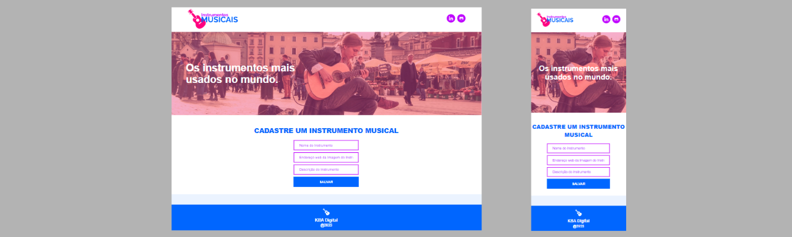

# **Hook useState**


## Sobre o projeto

Projeto: [trabalho de react js](https://react-hook-use-state-instrumentos-musicais.vercel.app/)

Demonstra o uso de estados, props, componentes, listas e estilos. Layout simples e organizado. Consiste em salvar os dados do instrumento musical. O usuário informa o nome, a url da imagem e a descrição, onde o nome e a descrição tem limites de caracteres e todos os campos são obrigatórios. Ao salvar, os dados são exibidos.

Demonstrates the use of states, props, components, lists, and styles. Simple and organized layout. It consists of saving the musical instrument data. The user enters the name, image url and description, where the name and description have character limits and all fields are mandatory. When saving, the data is displayed.

## Layout web e mobile 



## Tecnologias Utilizadas

* HTML 5
* CSS 3
* Flexbox
* React
* Module CSS

## Ferramenta de desenvolvimento

<p float="left">
    
</p>

## Instalação do projeto

##### Instalação de dependências via terminal (Installing dependencies via terminal)
```
    npm install
```

## Execução do projeto

##### Iniciar o projeto (Start the project)
```
    npm start
```

## Autor

#### **Katarine Albuquerque**

<p float="left">
    <a href="https://www.linkedin.com/in/katarine-albuquerque/" target="_blank">
        
    </a>
    &nbsp;
    <a href="mailto:kba.2879@gmail.com" target="_blank">
        
    </a>
</p>
